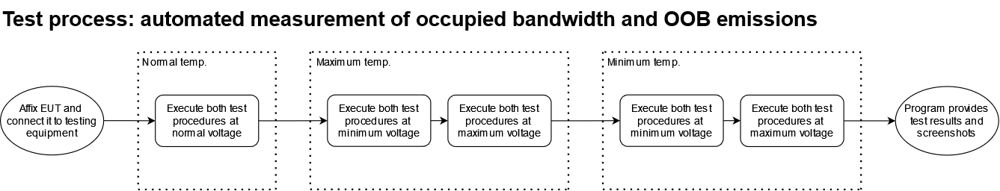

## Automating Occupied Bandwidth and Out-Of-Band Emissions measurements in the context of ETSI EN 300 220-1

---
### Development (10.07.2024)

- [ ] Integrate climatic test chamber into test process
- [ ] Implement queries after relevant executed process in order to guarantee correct execution (SPS!)
- [ ] Add multithreading to prevent GUI from freezing up during measurement
- [ ] Add 'emergency stop' button to safely stop measurement in case of failure of some kind
- [ ] Implement more complete error handling
- [ ] Detect if any connection interrupted during testing and stop measurement
- [ ] Implement dynamic instantiation of device objects via PyVISA resource manager at start of program
- [ ] Deliberate: does the constant connecting/disconnecting between operations make sense?
- [ ] Optimize program timing

---

Automating measurement procedures in compliance testing for radio equipment isn't easy without spending a lot of money for proprietary solutions. This project aims to implement a basic automation solution in Python for two specific tests in the context of ETSI EN 300 220-1: occupied bandwidth and out-of-band emissions. EN 300 220-1 is a standard applying to short-range devices (SRD) in the frequency range of 25 MHz to 1 GHz. These two tests require testing under extreme conditions which further add to the effort needed to execute them manually. The automation solution integrates three instruments: a Spitzenberger and Spies system that acts as an AC/DC power supply for the equipment under test (EUT), a Weiss Technik Climatic Test Chamber in which the EUT is placed to simulate extreme conditions and a Rohde & Schwarz FSV Spectrum Analyzer for monitoring and measurement. The automated test process is outlined as follows:

